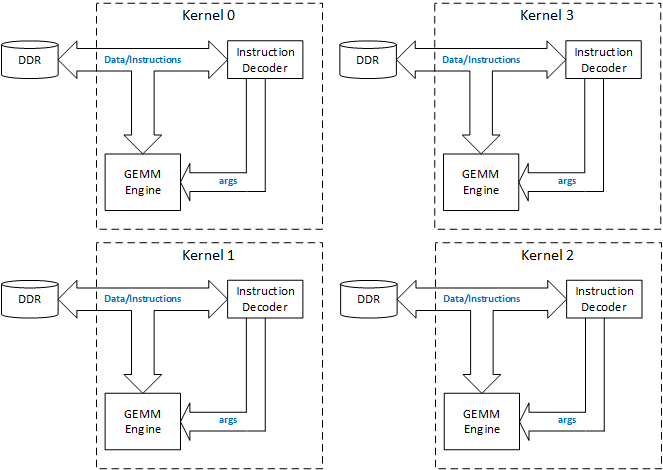

GEMM API User Guide
======================

This user guide contains the following sections:

1. OVERVIEW
2. SOFTWARE TOOLS AND SYSTEM REQUIREMENTS
3. AN USAGE EXAMPLE
4. GEMM API LIST
5. DESIGN FILE HIERARCHY
6. SUPPORT
7. LICENSE AND CONTRIBUTING TO THE REPOSITORY
8. ACKNOWLEDGEMENTS
9. REVISION HISTORY


## 1. OVERVIEW
THE GEMM APIs allow users to offload matrix multiplications to the Amazon cloud with GEMM accelerator FPGA cards. These APIs are designed to work with the GEMM engine library realized on an FPGA. 


*<center>Fig. 1: GEMM Accelerator Architecture</center>*

As shown in Figure 1, the GEMM enigne library implementation includes 4 identical kernels, with each kernel has its dedicated global memory, in this case, a DDR bank. Inside a kernel, an *instruction decoder* and an *GEMM engine* are built to decode and execute matrix multiplication instructions given by the client or host code software. Each instruction contains the opcode (in this case, gemm), the DDR addresses of input and output matrices and the size and lead dimension information of the matrices. Once the instruction is decoded by the *instruction decoder*, the matrices information is passed to the *GEMM engine* to trigger the engine. Once the engine is triggered, it will start to read input matrices from the DDR, carry out block-wise matrix multiplication and finally write the results block-by-block back to the DDR. This instruction decoding and execution step can be repeated again and again. In the current implementation, each kernel can execute maximum **16** instructions with the last instruction to be a specific *lastOp* instruciton to indicate the end of the kernel and to inform the host to read the results back from DDR. Given this limitation, the host code can offload maximum **15** matrix multiplications to one kernel in one shot or without any interruption, meaning no data transfer back to the host memory. This is extremely efficient if the offloaded operation is a chain of matrix multiplications, for example, C1 = A1 * B1; C2 = C1 * B2; C3 = C1 * C2. With 4 kernels, the maximum number of matrix multiplications in one shot can reach **60**. The APIs presented here cover all aspects of using this accelerator library.

## 2. SOFTWARE AND SYSTEM REQUIREMENTS
* AWS F1 instance that has GEMM engine library card installed
* gcc 6.2.0
* local version of the repository

## 3. AN USAGE EXAMPLE
File src/gemx_api_gemm.cpp gives an example of using GEMM APIs to measure the performance of the GEMM engine library.

### 3.1. COMPILING AND RUNNING THE EXAMPLE
 To compile this example, please follow the steps below:
1. navigate to the gemx/ directory, and change the path of gcc to point to the location of gcc 6.2.0 installed on your local machine, and then run command:

```
make GEMX_ddrWidth=32 GEMX_gemmMBlocks=8 GEMX_gemmKBlocks=8 GEMX_gemmKBlocks=8 GEMX_numKernels=4 out_host/gemx_api_gemm.exe
``` 
2. copy the generated gemx_api_gemm.exe to the AWS F1 instance, and set up the SDAccel environment on F1 by following the steps listed on: 
* [AWS F1 Application Execution on Xilinx Virtex UltraScale Devices]
3. launch the application via following command:
```
gemx_api_gemm.exe gemx.awsxclbin 512 512 512
```
make sure the gemx_api_gemm.exe is under the same directory as the gemx.awsxclbin

If you see following output, that means your run is successful.

```
INFO: Calculating gold values on host ...
  Compared 262144 values:  exact match 262144  within tolerance 0  mismatch 0
INFO: accelerator kernel 0 result MATCHES the reference
INFO: status PASS
  Compared 262144 values:  exact match 262144  within tolerance 0  mismatch 0
INFO: accelerator kernel 1 result MATCHES the reference
INFO: status PASS
  Compared 262144 values:  exact match 262144  within tolerance 0  mismatch 0
INFO: accelerator kernel 2 result MATCHES the reference
INFO: status PASS
  Compared 262144 values:  exact match 262144  within tolerance 0  mismatch 0
INFO: accelerator kernel 3 result MATCHES the reference
INFO: status PASS
```
### 3.2. EXAMPLE CODE STRUCTURE

## 4. GEMM API LIST
## 5. DESIGN FILE HIERARCHY

## 6. SUPPORT
For more information about SDAccel check the [SDAccel User Guides][]

For questions and to get help on this project or your own projects, visit the [SDAccel Forums][].


## 7. LICENSE AND CONTRIBUTING TO THE REPOSITORY
The source for this project is licensed under the [3-Clause BSD License][]

To contribute to this project, follow the guidelines in the [Repository Contribution README][]

## 8. ACKNOWLEDGEMENTS
This example is written by developers at
- [Xilinx](http://www.xilinx.com)

## 9. REVISION HISTORY
Date | README Version | Description
-----|----------------|------------
Oct2017|1.0|Initial Xilinx Release

[3-Clause BSD License]: https://github.com/Xilinx/SDAccel_Examples/blob/master/LICENSE.txt
[SDAccel Forums]: https://forums.xilinx.com/t5/SDAccel/bd-p/SDx
[SDAccel User Guides]: http://www.xilinx.com/support/documentation-navigation/development-tools/software-development/sdaccel.html?resultsTablePreSelect=documenttype:SeeAll#documentation
[Nimbix Getting Started Guide]: http://www.xilinx.com/support/documentation/sw_manuals/xilinx2016_2/ug1240-sdaccel-nimbix-getting-started.pdf
[Walkthrough Video]: http://bcove.me/6pp0o482
[Nimbix Application Submission README]: https://github.com/Xilinx/SDAccel_Examples/blob/master/utility/nimbix/README.md
[Repository Contribution README]: https://github.com/Xilinx/SDAccel_Examples/blob/master/CONTRIBUTING.md
[AWS F1 Application Execution on Xilinx Virtex UltraScale Devices]: https://github.com/aws/aws-fpga/blob/master/SDAccel/README.md
